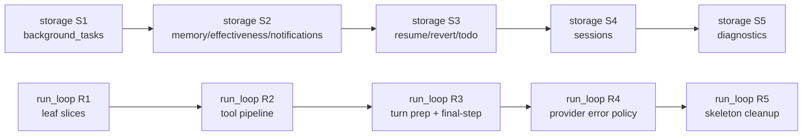

# P2 单体拆解设计：storage.py 领域簇拆分 + execute_graph_loop 切片

> 状态：已实现（2026-08-18，commits 620d5148 storage mixins / 182d4774 run_loop 切片）；文档中的行号描述的是拆分前代码树
> 依据：`docs/runtime-coupling-audit.md` §2.3/§2.4/§5（P2 项）+ `docs/runtime-architecture-refactor-plan.md`（Change Gate / 规则 7）
> 范围：`src/voidcode/runtime/storage.py`（5280 行）、`src/voidcode/runtime/run_loop.py:1142-2558`（execute_graph_loop，1417 行）
> 约定：不写实现代码，函数签名草案可；标注 `[推断]` 处为未直接验证的推测

---

## 1. 结论先行

### 1.1 storage.py 拆解策略

**`SqliteSessionStore` 保持"主类门面 + 私有实现 mixin 切片"**：主类继续持有全部 schema/连接治理与跨域共享 helper（约 30 个方法，含 `__init__`），9 个领域簇拆成 9 个私有 mixin 模块（`storage_background_tasks.py`、`storage_sessions.py`、`storage_memory.py`、`storage_resume.py`、`storage_revert.py`、`storage_todos.py`、`storage_notifications.py`、`storage_effectiveness.py`、`storage_diagnostics.py`），`SqliteSessionStore` 多重继承它们。

选择 mixin 而非组合委托/`__getattr__` 委托的理由（详见 §3）：

- **157 个方法内部约 150 处 `self._xxx()` 交叉调用**（实测调用图，§2.3）在 mixin 下**零改动**；组合委托需要把私有调用改写为经子对象路由（改动面大）或生成 ~50 个 public 转发方法（proxy 反模式，违反 refactor plan 规则 7 的精神）。
- **私有方法名全部不变**；测试直接触碰的私有方法只有 4 个（`_connect`×7、`_parse_session_status`×2、`_resolve_database_path`×1、`_write_connect`×2，均属 foundation，本来就不动）→ **测试零破坏**。
- `SessionStore` Protocol（storage.py:178，47 个 stub）与 `SessionEventAppender`（storage.py:385）**一字不改**；外部消费方（service.py:612/736、background_tasks.py:164、resume.py:184、run_loop.py:498、bundle.py:46）全部按 Protocol 类型化，无感知。
- 实例化方式不变：`SqliteSessionStore()` / `SqliteSessionStore(database_path=...)`（service.py:736 + 数百处测试）签名不动。

### 1.2 execute_graph_loop 切片策略

**按"一次循环迭代的职责"切成 20 个协作方法（含 1 个共享 hook 子切片）+ 3 个新纯函数**，主循环退化为"verdict 分发骨架"（约 60 行）。不新增类型：切片间用现有类型（`RuntimeStreamChunk`、`GraphRunRequest`、`SessionState`、`ToolResult`）+ `tuple`/`dict` verdict 传参（§4.4 骨架、§4.5 约定）。fallback 纯决策已抽到 `provider_fallback.py`（`decide_provider_error_policy` 等），切片只搬编排。

### 1.3 方法数勘误（用户给的"209" vs 实际 157）

实测 AST 清点：`SqliteSessionStore` 类体共 **157 个方法（50 public / 107 private）**，与审计 §2.3 记录一致（keep-alive/collaborator/P1 新增已包含在 157 内，并非"比审计多"）。"209" = 157（类方法）+ 48（`SessionStore` 47 + `SessionEventAppender` 1 的 Protocol stub，storage.py:178-401）+ 4（模块级 helper：`_assert_terminal_session_events_allowed` 125、`_pending_path_scope` 148、`_pending_operation_class` 156、`_pending_permission_decision` 166）。本设计的拆分对象是 157 个类方法；Protocol stub 与模块级函数不动。

---

## 2. storage 领域簇归类表（157 方法 → 簇 → 目标模块）

按审计 §2.3 的职责簇归类，全量覆盖 157 个方法（AST 验证：无遗漏、无重名 → mixin 无 MRO 冲突；storage.py 内 0 处 `super()`）。行号为当前文件实际位置。

### 2.1 簇 → 模块总表

| 职责簇 | 方法数 | 行数(约) | 目标模块 | mixin 名 | 对外交叉依赖（仅 schema/foundation 之外） |
|---|---|---|---|---|---|
| schema/连接治理（foundation） | **30** | 634 | **留在主类** | —（主类自身） | 被所有簇依赖 |
| background task 持久化 | **33** | 1114 | `storage_background_tasks.py` | `_BackgroundTaskStorageMixin` | 无（仅→foundation） |
| session 行/快照/事件 | **18** | 844 | `storage_sessions.py` | `_SessionStorageMixin` | →notifications 7、→resume 3、→background 3、→revert 3、→todo 3、→diagnostics 1（`_auto_prune_sessions`） |
| resume（approval/question/checkpoint） | **20** | 605 | `storage_resume.py` | `_ResumeStorageMixin` | →notifications 4、→background 2、→sessions 2 |
| diagnostics/prune/reset | **17** | 540 | `storage_diagnostics.py` | `_DiagnosticsStorageMixin` | →background 1（`_background_task_status_counts`） |
| memory | **13** | 209 | `storage_memory.py` | `_MemoryStorageMixin` | 无 |
| notifications | **12** | 384 | `storage_notifications.py` | `_NotificationStorageMixin` | →sessions 3（`_result_summary`×3）、→foundation |
| revert/undo | **8** | 197 | `storage_revert.py` | `_RevertStorageMixin` | →todo 1（`_todo_state_from_events`） |
| todo 投影 | **5** | 106 | `storage_todos.py` | `_TodoStorageMixin` | 无 |
| tool effectiveness | **1** | 58 | `storage_effectiveness.py` | `_EffectivenessStorageMixin` | 无 |
| **合计** | **157** | 4691 | | | |

> 行数为方法体近似（方法起始行到类内下一方法起始行），sum 与文件体量一致。mixin 之间的调用（如 sessions→`_sync_background_task_durable_state`、resume→`_write_session_snapshot`）经 `self` 在 MRO 中解析，**与所在模块无关**（§3.3）。

### 2.2 各簇方法清单（拆分依据，逐方法）

**foundation —— 留在主类（不动）**：`__init__` 562、`_resolve_database_path` 565、`_connect` 571、`_is_schema_mismatch_runtime_error` 610、`_reset_storage_in_place` 614、`_configure_connection` 625、`_write_connect` 642、`_ensure_schema` 644（204 行）、`_ensure_workspace_indexes` 857、`_ensure_storage_sequences` 870、`_max_existing_timestamp` 931、`_bump_sequence_floor` 936、`_assert_existing_schema_version` 943、`_assert_schema_version` 974、`_assert_canonical_schema` 992、`_assert_canonical_table_shape` 1022、`_assert_canonical_unique_indexes` 1052、`_table_columns` 1071、`_table_unique_indexes` 1087、`_raise_schema_mismatch` 1104、`_parse_session_status` 1113、`_parse_event_source` 1129、`_parse_background_task_status` 1139、`_parse_memory_kind` 1157、`_parse_memory_status` 1163、`_session_last_event_sequence` 1171、`_next_sequence_value` 5262、`_next_timestamp` 5279、`_current_unix_ms` 4233、`_next_auxiliary_timestamp` 4263（跨 sessions/notifications/diagnostics 共享，归 foundation）。类常量 `_SCHEMA_VERSION`/`_MEMORY_KINDS`/`_RESUME_CHECKPOINT_KINDS`/`_sqlite_policy`/`_DEFAULT_MAX_*`/`_CANONICAL_SCHEMA`/`_CANONICAL_UNIQUE_INDEXES`（417-524）一并留下（mixin 内经 `cls._MEMORY_KINDS`/`cls._RESUME_CHECKPOINT_KINDS` 引用，MRO 可解析，storage.py:1158/1448/1734 不改）。

**storage_background_tasks.py（33）**：`_background_task_runtime_state_defaults` 1453、`_request_id_from_pending_payload` 1462、`_background_task_runtime_state_from_session_row` 1472、`_background_task_summary_from_row` 1484、`_background_task_durable_payload` 1499、`_delegated_reminder_state_payload` 1527、`_parse_delegated_reminder_stop_condition` 1548、`_delegated_reminder_state_from_payload` 1564、`create_background_task` 3427、`load_background_task` 3495、`list_background_tasks` 3512、`list_queued_background_tasks` 3529、`list_running_background_tasks` 3546、`list_background_tasks_by_parent_session` 3569、`load_background_task_by_child_session` 3586、`mark_background_task_running` 3610、`mark_background_task_terminal` 3658、`mark_background_task_idle` 3722、`mark_background_task_steered` 3764、`request_background_task_cancel` 3808、`record_background_task_idle_reminder_eligible` 3891、`mark_background_task_idle_reminder_sent` 3955、`stop_background_task_idle_reminder` 4009、`fail_incomplete_background_tasks` 4048、`persist_background_task_runtime_state` 4154（**生产死代码，仅 tests/unit/runtime/test_background_task_storage.py:886 调用**，标注见 §6）、`_background_task_state_from_row` 4198、`_background_task_runtime_row` 4236、`_linked_session_background_task_runtime_state` 4266、`_sync_background_task_durable_state` 2637（sessions/resume 亦调用，mixin 间经 `self` 可达）、`_stop_delegated_reminder_state` 2695、`_enriched_background_task_event_payload` 2722、`_background_task_status_counts` 4555、`_next_background_task_timestamp` 4257（簇内专用，随簇走）。

**storage_sessions.py（18）**：`save_run` 1620、`list_sessions` 1692、`_auto_prune_sessions_for_list` 1721、`has_session` 3016、`load_session` 3048、`load_session_status` 3061、`update_session_metadata` 3080、`_load_session_response` 3092、`load_session_result` 3173、`read_recent_tool_results` 3031（public 但**不在** Protocol 内）、`append_session_event` 2270（public，SessionEventAppender 覆盖）、`append_session_events` 2377、`save_interrupted_checkpoint` 2487、`truncate_session_events_after` 2608、`_write_session_snapshot` 1281（resume 亦调用）、`_checkpoint_skill_snapshot` 1389、`_tool_results_from_events` 2927、`_result_summary` 4918（notifications 亦调用）。

**storage_resume.py（20）**：`_resume_checkpoint_base` 1399、`_decode_json_object_payload` 1426、`_decode_resume_checkpoint_payload` 1441、`_optional_string` 1588、`_optional_int` 1596、`_pending_question_payload` 1604、`save_pending_approval` 1933、`load_pending_approval` 1979、`clear_pending_approval` 2073、`save_pending_question` 2081、`load_pending_question` 2128、`clear_pending_question` 2242、`load_resume_checkpoint` 2250、`_read_pending_approval_json` 2745、`_approval_wait_resume_checkpoint` 2758、`_question_wait_resume_checkpoint` 2782、`_provider_failure_retryable_resume_checkpoint` 2816、`_terminal_resume_checkpoint` 2846、`_run_resume_checkpoint` 2860、`_interrupted_resume_checkpoint` 2902。

**storage_diagnostics.py（17）**：`storage_diagnostics` 4335、`prune_runtime_storage` 4374、`reset_runtime_storage` 4455、`_unlink_with_retries` 4474、`_pragma_scalar` 4485、`_wal_checkpoint` 4490、`_database_file_sizes` 4501、`_storage_table_counts` 4510、`_pending_state_counts` 4574、`_count_for_ids` 4593、`_delete_for_ids` 4614、`_prunable_session_ids` 4634、`_retained_background_task_session_ids` 4676、`_prunable_background_task_ids` 4701、`_auto_prune_sessions` 4739、`_dangling_parent_terminal_session_ids` 4829、`_orphaned_terminal_background_task_ids` 4881。

**storage_memory.py（13）**：`_validate_memory_content` 1727、`_validate_memory_kind` 1733、`_validate_memory_tags` 1739、`_memory_record_from_row` 1748、`add_memory` 1773、`list_memories` 1812、`_memory_search_terms` 1831、`_score_memory` 1842、`search_memories` 1848、`get_memory` 1865、`delete_memory` 1881、`_memory_row` 1912、`_next_memory_timestamp` 4260（簇内专用，随簇走）。

**storage_notifications.py（12）**：`list_notifications` 3405、`acknowledge_notification` 4288、`_sync_notifications` 4947（125 行；sessions/resume 亦调用）、`_notification_candidate` 5073、`_approval_notification_candidate` 5104、`_question_notification_candidate` 5131、`_terminal_notification_candidate` 5163、`_notification_from_row` 5198、`_read_created_at` 5214、`_read_created_at_unix_ms` 5226、`_read_last_event_sequence` 5239、`_max_persisted_event_sequence` 5252。

**storage_revert.py（8）**：`_revert_marker_from_metadata` 3208、`_metadata_with_revert_marker` 3223、`_active_revert_metadata` 3237、`_session_metadata_and_events` 3260、`_write_revert_marker` 3307、`revert_session` 3335、`undo_session` 3356、`unrevert_session` 3385。

**storage_todos.py（5）**：`_todo_state_from_metadata` 1175、`_replace_session_todos` 1185、`_todo_state_from_rows` 1220、`_metadata_with_todo_state` 1256、`_todo_state_from_events` 1269。几乎纯投影：后两者是 staticmethod/classmethod，`_replace_session_todos`/`_todo_state_from_rows` 收 `connection` 参数（storage.py:1186/1221），不自己开连接——最易搬。

**storage_effectiveness.py（1）**：`tool_effectiveness_report` 2958（58 行；经 `self._connect` + `self._parse_event_source`，纯只读投影，交给 `effectiveness.project_tool_effectiveness`）。

### 2.3 交叉依赖证据（实测自调用图，决定"哪些先拆、哪些留主类"）

- **foundation 是全簇公共依赖**：`_write_connect` 被 29 处调、`_connect` 21 处、`_parse_background_task_status` 9 处、`_next_timestamp`/`_current_unix_ms`/`_next_*_timestamp` 各 8-13 处 → 必须留主类。
- **background / memory / effectiveness / todo 对其它领域簇零出边**（todo 甚至不调用任何 self 方法——纯投影，`_replace_session_todos`/`_todo_state_from_rows` 收 `connection` 参数）→ 最独立，最先拆。
- **sessions 是交叉枢纽**：出边至 notifications(7)/resume(3)/background(3)/revert(3)/todo(3)/diagnostics(1) → 最后拆（其被调方已全部就位后，模块边界才有意义；mixin 下顺序不影响正确性，只影响评审面）。
- **跨簇被调方**（定义在 A 簇、B 簇也调）：`_sync_background_task_durable_state`（sessions 1675/1961/2109 调）、`_enriched_background_task_event_payload`（append_session_event(s) 调）、`_write_session_snapshot`（resume 调）、`_sync_notifications`（sessions/resume 调）、`_result_summary`（sessions + notifications 调）、`_next_auxiliary_timestamp`（sessions 2 处、notifications 3 处调用）→ 这些方法**归其所在簇模块**，跨簇调用点经 `self` 不变。

---

## 3. storage 拆解机制选择：mixin（含理由与结构草案）

### 3.1 候选机制对比

| 机制 | 内部 ~150 处 `self._foo()` 调用 | 私有方法名 | public 转发代码 | `@final` | 静态检查 | 评价 |
|---|---|---|---|---|---|---|
| **私有实现 mixin**（选定） | 全部零改动 | 全部不变 | 0 | 保持（mixin 是基类，不子类化主类） | ruff 无类型检查，无碍；可选内部 Protocol 锚定 | ✅ 文件组织纯搬运，风险最低 |
| 组合委托（facade 持有子对象 + 显式转发） | 需改写为 `self._bg._foo()` 或转发 | 内部调用点全改 | ~50 个 public 转发 + 私有转发 | 保持 | 好 | ❌ 转发方法即 proxy 反模式（refactor plan 规则 7 精神）；改动面最大 |
| `__getattr__` 动态委托 | 零改动 | 不变 | 0 | 保持 | **动态、无类型、API 隐身** | ❌ 与"类型化契约"方向（审计 §5.4）直接冲突 |
| 模块级函数 `_foo(store, ...)` | ~150 处调用点改写为 `_foo(self, ...)` | 语义名不变但宿主变 | 0 | 保持 | 好 | ❌ 违背"私有方法名尽量不变"约束；改写面 = 全部内部调用点 |
| 全量移出 foundation（主类仅剩 import） | 同上（mixin 情形零改动） | 不变 | 0 | 保持 | 好 | 可作 S5 后的可选收尾，但超出本任务（用户明确"schema 治理留在主类"） |

### 3.2 为什么 mixin

1. **实例状态单一**：所有簇共享同一份状态（`_database_path`、`_sqlite_policy`、连接纪律）且无独立生命周期——组合委托的"独立子对象"前提不成立；mixin 是"同一对象的不同实现切片"的 Python 惯用工具。
2. **公共 API 零变化**：`dir(SqliteSessionStore)` 集合不变（继承成员与定义成员在 `dir` 上无差别）；`isinstance(store, SessionStore)`（runtime_checkable，storage.py:177）与 background_tasks.py:1520 的 `isinstance(..., SessionEventAppender)` 运行时检查不受影响。
3. **测试零破坏**：测试直接实例化 `SqliteSessionStore()` / `(database_path=...)`（全仓数百处）且触碰的 4 个私有方法全部属于 foundation（§1.1），`_connect`/`_write_connect`/`_parse_session_status`/`_resolve_database_path` 照常经 MRO 解析。
4. **MRO 安全**：157 个方法名唯一（AST 验证，§2.1）；全文件 0 处 `super()`；类常量引用经 `cls.`（1158/1448/1734）不受 MRO 影响。
5. **边界纪律**：mixin 命名全部 `_*StorageMixin`（私有），对外不可见；`@final` 继续阻止外部子类化。

### 3.3 结构草案（签名级）

```python
# storage.py —— 门面 + foundation（主类），文件尾部 import 各 mixin
from .storage_background_tasks import _BackgroundTaskStorageMixin
from .storage_sessions import _SessionStorageMixin
# ... 其余 7 个


@final
class SqliteSessionStore(
    _BackgroundTaskStorageMixin,
    _SessionStorageMixin,
    _MemoryStorageMixin,
    _ResumeStorageMixin,
    _RevertStorageMixin,
    _TodoStorageMixin,
    _NotificationStorageMixin,
    _EffectivenessStorageMixin,
    _DiagnosticsStorageMixin,
):
    # —— foundation：__init__ 562 / _connect / _write_connect / _ensure_schema /
    #    _parse_* / _next_sequence_value / _next_timestamp / _current_unix_ms /
    #    _next_auxiliary_timestamp / schema 常量（417-524）—— 原样保留 ——
    ...
```

```python
# storage_background_tasks.py —— 私有实现切片（示例，其余模块同构）
# imports：sqlite3 / json / Path / 领域类型（BackgroundTaskState, task.py 矩阵 …）
class _BackgroundTaskStorageMixin:
    def create_background_task(self, *, workspace: Path, task: BackgroundTaskState) -> None: ...  # 原 3427，体原样
    def mark_background_task_terminal(
        self, *, workspace: Path, task_id: str, status: BackgroundTaskStatus, error: str | None = None
    ) -> BackgroundTaskState: ...

    # …… 33 个方法原样搬运；self._write_connect / self._parse_background_task_status
    # 等经主类 MRO 解析，无需 import
```

**import 方向（无环）**：`storage.py` → 9 个 mixin 模块；mixin 模块只 import 非 storage 兄弟模块（`.contracts`/`.events`/`.memory`/`.session`/`.task`/`.todos`/`.permission`/`.question`/`.paths`/`.session_metadata_helpers`/`.effectiveness`）。mixin 内对主类成员的访问全部经 `self`/`cls`，不需要 import 回 storage.py。

**类型化（可选收尾）**：仓库只用 ruff（pyproject `[tool.ruff]`，无 mypy），mixin 内 `self._connect` 不会被静态检查报错。若未来引入类型检查器，可在新建的 `storage_foundation.py` 放一个内部 `_SqliteStorageShared` Protocol（约 10 个 stub：`_connect`/`_write_connect`/`_parse_*`/`_next_*`/`_resolve_database_path`）作为各 mixin 的基类锚点。本设计不强制，标注为可选。

### 3.4 不动的部分（清单）

- 模块级：`_TERMINAL_ALLOWED_EVENT_TYPES`（~79）、`_assert_terminal_session_events_allowed` 125、`_pending_path_scope` 148、`_pending_operation_class` 156、`_pending_permission_decision` 166、`SessionStore` Protocol 178、`SessionEventAppender` Protocol 385、`_SQLitePolicy` 402。
- 主类 foundation 30 方法 + 类常量（§2.2）。
- `__init__` 签名（`database_path: Path | None = None`，storage.py:562）。
- 所有 public 方法签名与语义（哪怕搬到 mixin，签名原样）。

---

## 4. execute_graph_loop 切片

### 4.1 现状分段（行号证据，run_loop.py）

| 段 | 行 | 职责 |
|---|---|---|
| 签名 + 局部状态 | 1142-1165 | runtime surface、provider_attempt/retry、ReasoningCaptureState、active_graph_request、pending_provider_attempt_reset、first_iteration、stuck_detected_emitted、checkpoint_tool_result_count |
| 循环头 | 1166 | `while True:` |
| provider reset 应用 | 1167-1170 | pending_provider_attempt_reset → 四元状态恢复 |
| checkpoint 捕获 | 1172-1186 | `_at_safe_boundary` + `_capture_interrupted_checkpoint` |
| submit_result 终态 | 1189-1214 | 非空校验、`session_with_plan_state(completed)`、`graph.response_ready`、yield output、break |
| turn-progress hook | 1219-1268 | payload 组装、hook 执行、chunks 持久化、failed/cancel 两条提前 return |
| stuck-detected hook | 1272-1319 | 一次性触发 + 同上失败/取消处理 |
| context 窗口 | 1300-1365 | first_iteration prebuilt 复用 vs `prepare_provider_context_window`、continuity reinject |
| assemble + transform | 1367-1418 | 段过滤、`assemble_provider_context`、payload 合并、transform 指纹/事件 |
| provider-context-policy | 1423-1468 | warn 事件 / blocked 失败块 |
| context-compacted 判定 | 1470-1492 | `_should_emit_context_compacted` + 事件 |
| provider 调用 | 1508-1582 | abort 检查、stream_step vs graph.step、reasoning 捕获、`provider_retry_attempt = 0` |
| fallback 决策应用 | 1584-1780 | `decide_provider_error_policy` + `fallback_graph_for_provider_error` + transient/fallback/terminal 各分支（事件 + 状态重建 + continue/return/raise） |
| reasoning 聚合持久化 | 1772-1798 | `RUNTIME_REASONING_PART` |
| final-step 判定 | 1801-1852 | `is_final_step`、keep_alive 契约校验、abort、provider_usage/retry/attempt 重置、终态 status（interrupted/completed）、current_chunk_session |
| 事件重编号 + 持久化 | 1853-1865 | `renumber_events`（.events 模块）→ `_persist_events` → yield |
| final 输出 | 1867-1886 | reasoning_diagnostic、output、break |
| 工具计划 | 1887-1990 | plan_tool_call 提取、tool_request_created、delegation/tool 策略拒绝、registry resolve、lookup 事件、invoke_tool 分发 |
| 权限/审批 | 1995-2068 | approval_resolution 匹配/回退、resolve_permission、denied 反馈 |
| pre-tool hook | 2072-2112 | 同 turn hook 形状（failed/cancel） |
| 工具启动/调用/恢复 | 2113-2295 | started 事件、abort、`_invoke_tool`、timeout/不可恢复/可恢复三分支 |
| todo 去重 + 清洗 | 2300-2321 | `todo_state_matches_payload`、sanitize、cap |
| drain + abort | 2323-2339 | `_drain_runtime_events`、迟到结果丢弃 |
| question 终态 | 2342-2375 | `RUNTIME_QUESTION_REQUESTED`、waiting session、return |
| tool_completed 事件 | 2377-2453 | completed payload 组装（identity/display/status） |
| skill/todo 事件 | 2455-2498 | `RUNTIME_SKILL_LOADED`、`RUNTIME_TODO_UPDATED` |
| post-tool hook | 2506-2533 | 同 pre 形状 |
| 收尾 | 2538-2555 | `tool_results.append`、`_provider_attempt_reset_after_tool_result` |

### 4.2 切片清单（20 个协作方法 = 切片 1-20（含共享子切片 3a）+ 3 个新纯函数）

统一约定：`Generator[RuntimeStreamChunk, None, T]` = 生成器切片（内部 `yield from self._persist_chunk(s)/_persist_event(s)` 并 yield 对外 chunk，`return T` 经 `yield from` 回传）；纯函数无 `self`。`runtime = self._surface`。

**A. 终态与 checkpoint（迭代边界）**

| # | 切片 | 职责 | 输入 | 输出 | 纯函数? |
|---|---|---|---|---|---|
| 1 | `_capture_iteration_checkpoint(*, session, graph_request, tool_results, sequence, checkpoint_tool_result_count) -> int` | checkpoint 捕获（1172-1186） | 现有局部 | 新的 checkpoint_tool_result_count | 否（用 `self._at_safe_boundary`/`self._capture_interrupted_checkpoint`） |
| 2 | `_submit_result_terminal(*, session, graph_request, tool_results, sequence) -> Generator[RuntimeStreamChunk, None, int]` | submit_result 终态（1189-1214）：非空校验、completed session、`graph.response_ready`、yield output；返回新 sequence | 同上 | yield 2 chunk；return sequence | 否（`self._persist_event`） |

**B. turn 准备（hook + context + 策略事件）**

| # | 切片 | 职责 | 输入 | 输出 | 纯函数? |
|---|---|---|---|---|---|
| 3 | `_run_turn_hooks(*, session, sequence, active_graph_request, tool_results, turn_index, provider_attempt, provider_retry_attempt, stuck_detected_emitted) -> Generator[RuntimeStreamChunk, None, tuple[int, bool]]` | turn-progress + stuck-detected hook 编排（1219-1319）；返回 (sequence, terminated)；内部用共享 `_run_turn_hook_phase` | 现有局部 | (sequence, terminated) | 否（`self._config`/`self._workspace`/`self._is_stuck_tool_loop`） |
| 3a | `_run_turn_hook_phase(*, session, sequence, surface, payload, cancel_message) -> Generator[RuntimeStreamChunk, None, tuple[int, bool]]`（共享私有） | 单 surface hook：执行 → chunks 持久化 → failed_error/cancel 失败块（1219-1268 与 1272-1319 的公共形状） | surface + payload | (sequence, terminated) | 否 |
| 4 | `_resolve_turn_context_window(*, active_graph_request, tool_results, session, continuity_to_reinject, first_iteration) -> tuple[RuntimeContextWindow, bool]` | context 窗口（1300-1365）：prebuilt 复用 vs 重建、continuity reinject | 现有局部 | (context_window, first_iteration) | 否（`runtime.prepare_provider_context_window`） |
| 5 | `_assemble_turn_context(*, active_graph_request, context_window, session) -> tuple[SessionState, ProviderAssembledContext, tuple[tuple[str, dict[str, object]], ...]]` | 段过滤 + assemble + payload 合并 + transform 指纹（1367-1418） | 现有局部 | (session, assembled_context, unseen_transform_payloads) | 否（`runtime.assemble_provider_context`） |
| 6 | `_emit_turn_context_events(*, session, sequence, active_graph_request, effective_runtime_config, context_window, assembled_context, unseen_transform_payloads) -> Generator[RuntimeStreamChunk, None, tuple[SessionState, int, bool]]` | 三子步：transform 事件（1405-1420）→ provider-context-policy warn/blocked（1423-1468）→ context-compacted（1470-1492）；blocked → yield 失败块 + terminated | 现有局部 | (session, sequence, terminated) | 否（`runtime.provider_context_policy_decision_for_graph_request`/`self._should_emit_context_compacted`/`self._build_context_compacted_payload`） |

**C. provider 调用与 fallback 决策应用**

| # | 切片 | 职责 | 输入 | 输出 | 纯函数? |
|---|---|---|---|---|---|
| 7 | `_invoke_provider_step(*, active_graph_request, tool_results, session, sequence, reasoning_capture_state) -> Generator[RuntimeStreamChunk, None, tuple[object | None, int, list[str]]]` | provider 调用（1508-1582）：前置 abort、stream_step vs graph.step、流内 abort 丢弃 + reasoning 聚合、非流 reasoning；成功返回 (graph_step, sequence, streamed_reasoning_texts)，abort 返回 graph_step=None（调用方 return） | 现有局部（`reasoning_capture_state` 原地更新，沿用现有可变 dataclass） | (graph_step, sequence, streamed_reasoning_texts) | 否（`self._persist_chunk`，仅 abort 路径 yield） |
| 8 | `_apply_provider_error_policy(*, exc, session, sequence, active_graph_request, context_window, effective_runtime_config, provider_attempt, provider_retry_attempt) -> Generator[RuntimeStreamChunk, None, dict[str, object]]` | 整个 except 块（1584-1780）：决策编排（`decide_provider_error_policy`/`fallback_graph_for_provider_error`/`provider_transient_retry_config`，纯函数已存在）、transient/fallback 事件 + 状态重建、terminal/cancelled/rate-limit/context-limit 失败块；返回 verdict dict（§4.5） | 现有局部 | verdict `{"action", "provider_attempt", "provider_retry_attempt", "graph", "session", "graph_request", "exc"}`；action ∈ retry/fallback/exit/reraise | 否（`self._persist_event`/`_persist_chunk`、`time.sleep`） |
| 9 | `_persist_turn_reasoning(*, session, sequence, streamed_reasoning_texts, reasoning_capture_state) -> Generator[RuntimeStreamChunk, None, int]` | 聚合 reasoning 持久化（1772-1798）：截断 → `runtime_reasoning_part_payload` → `RUNTIME_REASONING_PART` | 现有局部 | return sequence | 否 |

**D. 终态判定 + 事件重编号 + 输出**

| # | 切片 | 职责 | 输入 | 输出 | 纯函数? |
|---|---|---|---|---|---|
| 10 | `_finalize_step_state(*, session, sequence, active_graph_request, graph_step, provider_attempt) -> Generator[RuntimeStreamChunk, None, tuple[bool, SessionState, int, bool]]` | final-step 判定段（1801-1852）：`is_final_step`、keep_alive 子会话契约校验（raise ValueError）、abort（yield 失败块 + terminated）、provider_usage/retry/attempt 重置、终态 status、current_chunk_session；返回 (is_final_step, current_chunk_session, provider_attempt, terminated) | 现有局部 | 4 元组 | 否（abort 分支 yield）；**内部调纯函数 P1** |
| 11 | `_persist_step_events(*, session, sequence, graph_step, reasoning_capture_state, current_chunk_session) -> Generator[RuntimeStreamChunk, None, int]` | 事件重编号 + 批量持久化（1853-1865）：`renumber_events`（已存在纯函数）→ `_persist_events` → 逐条 yield | 现有局部 | return sequence | 否（`self._persist_events`） |
| 12 | `_emit_final_step_artifacts(*, runtime, session, sequence, graph_step, reasoning_capture_state) -> Generator[RuntimeStreamChunk, None, None]` | final 输出（1867-1886）：reasoning_diagnostic（`_reasoning_output_diagnostic` 已存在）+ output | 现有局部 | —（调用方 break） | 否（`self._persist_event`/`self._provider_catalog_query`） |

**E. 工具计划 / 权限 / hook / 执行**

| # | 切片 | 职责 | 输入 | 输出 | 纯函数? |
|---|---|---|---|---|---|
| 13 | `_plan_tool_step(*, session, sequence, active_graph_request, tool_registry, graph_step) -> Generator[RuntimeStreamChunk, None, tuple[object, object, str, int] | None]` | 工具计划（1887-1990）：plan 缺失 → 失败块 + raise；`tool_request_created`；delegation/tool 策略拒绝 → 失败块 + raise；registry resolve → 失败块 + raise；`tool_lookup_succeeded`；`invoke_tool` **不在此分发**（返回 None 由主循环处理） | 现有局部 | (plan_tool_call, tool, tool_call_id, sequence) 或 None | 否（`runtime.delegation_tool_policy_error`/`runtime.tool_policy_denial`/`self._persist_event`） |
| 14 | `_resolve_permission_for_tool(*, session, sequence, tool, plan_tool_call, tool_call_id, approval_resolution, active_permission_policy, effective_runtime_config, tool_results) -> Generator[RuntimeStreamChunk, None, tuple[str, SessionState, int]]` | 权限/审批（1995-2068）：approval 匹配/回退、`resolve_permission`、chunks 持久化、pending → return、denied → 反馈 + return/continue | 现有局部 | (action, session, sequence)；action ∈ return/continue/ok | 否（`runtime.approval_resolution_outcome`/`runtime.resolve_permission`/`self._permission_denied_tool_feedback_chunks`） |
| 15 | `_run_tool_hook_phase(*, session, sequence, tool_name, phase, cancel_message) -> Generator[RuntimeStreamChunk, None, tuple[int, str]]` | pre/post 工具 hook（2072-2112 与 2506-2533 共享）：failed_error → raise RuntimeError；cancel → 失败块 | phase ∈ "pre"/"post" | (sequence, verdict)；verdict ∈ ok/cancel | 否（`self._config`/`self._workspace`） |
| 16 | `_execute_tool_and_recover(*, session, sequence, plan_tool_call, tool, tool_call_id, tool_timeout, tool_results, active_graph_request, tool_exception_recovery_enabled) -> Generator[RuntimeStreamChunk, None, tuple[str, ToolResult | None, SessionState, int]]` | 启动/调用/恢复（2113-2295）：started 事件、前置 abort（`_started_tool_abort_chunks`）、`_invoke_tool`（yield from）、timeout 分支（3 事件 + 失败块 + returned）、不可恢复分支（事件 + 失败块 + raise）、可恢复 → 错误 ToolResult | 现有局部 | (action, tool_result, session, sequence)；action ∈ returned/ok；raise 传播 | 否 |
| 17 | `_finalize_tool_result(*, session, sequence, plan_tool_call, tool_call_id, tool_result, active_graph_request) -> Generator[RuntimeStreamChunk, None, tuple[ToolResult, bool, dict[str, object], SessionState, int, bool]]` | todo 去重/清洗/drain/abort（2300-2339）：`_normalized_tool_result`（纯函数 P2）、drain（yield）、迟到 abort 失败块 | 现有局部 | (tool_result, duplicate_todo_write, runtime_tool_result_data, session, sequence, terminated) | 否（`self._drain_runtime_events`） |
| 18 | `_handle_question_outcome(*, session, sequence, plan_tool_call, tool_result) -> Generator[RuntimeStreamChunk, None, bool]` | question 终态（2342-2375）：waiting session + `RUNTIME_QUESTION_REQUESTED`；返回 True → 调用方 return | 现有局部 | bool | 否 |
| 19 | `_emit_tool_completed_events(*, session, sequence, plan_tool_call, tool_call_id, sanitized_arguments, tool_result, runtime_tool_result_data, duplicate_todo_write) -> Generator[RuntimeStreamChunk, None, tuple[int, SessionState]]` | completed/skill/todo 事件（2377-2498）；payload 组装用纯函数 P3 | 现有局部 | (sequence, session) | 否 |

**F. 共享小切片**

| # | 切片 | 职责 | 输入 | 输出 | 纯函数? |
|---|---|---|---|---|---|
| 20 | `_emit_interrupted_failure(*, session, sequence, active_graph_request) -> Generator[RuntimeStreamChunk, None, None]` | 8 行 abort 失败块（1504-1509 / 1815-1822 / 2326-2339 / 2500-2509 四处重复）收敛为一处；调用方：`if _is_abort_requested(...): yield from self._emit_interrupted_failure(...); return` | 现有局部 | — | 否 |
| P1 | `_finalized_step_session(*, session, graph_step, is_final_step, provider_attempt) -> tuple[SessionState, int, str]`（模块级纯函数） | final-step 元数据重置 + 终态 status 推导（1801-1852 的纯子集）：`session_with_provider_usage_metadata`、retry/attempt 重置、keep_alive → "interrupted" 否则 "completed" | session/graph_step | (session, provider_attempt, final_step_status) | **是** |
| P2 | `_normalized_tool_result(*, tool_result, session, plan_tool_call, sequence) -> tuple[ToolResult, bool, dict[str, object]]`（模块级纯函数） | todo 去重 + sanitize + cap 链（2300-2321）：`todo_state_matches_payload`/`sanitize_tool_arguments`/`cap_tool_result_output`/`sanitize_tool_result_data`（均已存在纯函数） | 现有局部 | (tool_result, duplicate_todo_write, runtime_tool_result_data) | **是** |
| P3 | `_tool_completed_payload(*, session, tool_result, tool_call_id, sanitized_arguments) -> dict[str, object]`（模块级纯函数） | completed payload 组装（2377-2453 的纯子集）：`_tool_completed_identity_payload` + display/status/error 字段 | 现有局部 | payload dict | **是** |

### 4.3 已存在的模块级纯函数（切片时直接复用，不再新抽）

`provider_attempt_from_metadata`/`provider_retry_attempt_from_metadata`/`run_id_from_session_metadata`（provider_execution_metadata）、`renumber_events`（events.py:55）、`decide_provider_error_policy`/`provider_transient_retry_config`/`fallback_graph_for_provider_error`（provider_fallback，run_loop.py:63-69/96-97）、`classify_provider_error`、`_context_transform_applied_payloads` 232 / `_unseen_context_transform_payloads` 278 / `_replayed_conversation_segments` 390、`_tool_error_*` 141-373、`_tool_completed_identity_payload` 185、`_is_tool_timeout_like_exception` 469、`_is_abort_requested` 476 / `_abort_reason` 489、`_provider_attempt_reset_after_tool_result` 437（返回现有 `_ProviderAttemptReset` dataclass）、`todo_state_matches_payload`/`sanitize_*`/`cap_tool_result_output`/`build_tool_display`/`build_tool_status`/`read_tracking_for_tool_results`、`session_with_*` 元数据助手（session_metadata_helpers）。→ 审计 §2.4 的"fallback 纯决策已抽到 provider_fallback.py"即指这批；**切片只搬编排，不重写决策**。

### 4.4 主循环骨架（切片后形状，签名级）

```python
def execute_graph_loop(self, *, graph, tool_registry, session, sequence,
                       graph_request, tool_results, approval_resolution=None,
                       permission_policy=None, preserved_continuity_state=None):
    runtime = self._surface
    active_permission_policy = permission_policy or self._permission_policy
    continuity_to_reinject = preserved_continuity_state
    provider_attempt = provider_attempt_from_metadata(graph_request.metadata)
    provider_retry_attempt = provider_retry_attempt_from_metadata(graph_request.metadata)
    reasoning_capture_state = ReasoningCaptureState()
    active_graph_request = graph_request
    pending_provider_attempt_reset = None
    first_iteration = True
    stuck_detected_emitted = False
    checkpoint_tool_result_count = len(tool_results)
    while True:
        if pending_provider_attempt_reset is not None:      # 1167-1170：四元状态恢复（保持内联）
            provider_attempt = pending_provider_attempt_reset.provider_attempt
            graph = pending_provider_attempt_reset.graph
            active_graph_request = pending_provider_attempt_reset.graph_request
            session = pending_provider_attempt_reset.session
            pending_provider_attempt_reset = None
        checkpoint_tool_result_count = self._capture_iteration_checkpoint(   # 切片 1
            session=session, graph_request=graph_request, tool_results=tool_results,
            sequence=sequence, checkpoint_tool_result_count=checkpoint_tool_result_count)
        if (tool_results and tool_results[-1].tool_name == "submit_result"
                and tool_results[-1].status == "ok"):                        # 切片 2
            sequence = yield from self._submit_result_terminal(
                session=session, graph_request=graph_request,
                tool_results=tool_results, sequence=sequence)
            break
        sequence = int(sequence)
        turn_index = len(tool_results) + 1
        sequence, terminated = yield from self._run_turn_hooks(              # 切片 3（含 3a）
            session=session, sequence=sequence, active_graph_request=active_graph_request,
            tool_results=tool_results, turn_index=turn_index,
            provider_attempt=provider_attempt, provider_retry_attempt=provider_retry_attempt,
            stuck_detected_emitted=stuck_detected_emitted)
        if terminated: return
        context_window, first_iteration = self._resolve_turn_context_window( # 切片 4
            active_graph_request=active_graph_request, tool_results=tool_results,
            session=session, continuity_to_reinject=continuity_to_reinject,
            first_iteration=first_iteration)
        continuity_to_reinject = None
        session, assembled_context, unseen_payloads = self._assemble_turn_context(  # 切片 5
            active_graph_request=active_graph_request, context_window=context_window, session=session)
        active_graph_request = GraphRunRequest(session=session, prompt=...,      # 重建（保持内联）
            available_tools=..., context_window=context_window,
            assembled_context=assembled_context, metadata=...,
            abort_signal=...)
        effective_runtime_config = runtime.effective_runtime_config_from_metadata(session.metadata)
        session, sequence, terminated = yield from self._emit_turn_context_events(  # 切片 6
            session=session, sequence=sequence, active_graph_request=active_graph_request,
            effective_runtime_config=effective_runtime_config, context_window=context_window,
            assembled_context=assembled_context, unseen_transform_payloads=unseen_payloads)
        if terminated: return
        try:
            graph_step, sequence, streamed_reasoning_texts = yield from self._invoke_provider_step(  # 切片 7
                active_graph_request=active_graph_request, tool_results=tool_results,
                session=session, sequence=sequence,
                reasoning_capture_state=reasoning_capture_state)
            if graph_step is None: return
            provider_retry_attempt = 0
        except Exception as exc:
            verdict = yield from self._apply_provider_error_policy(           # 切片 8
                exc=exc, session=session, sequence=sequence,
                active_graph_request=active_graph_request, context_window=context_window,
                effective_runtime_config=effective_runtime_config,
                provider_attempt=provider_attempt, provider_retry_attempt=provider_retry_attempt)
            action = verdict["action"]
            if action == "exit": return
            if action == "reraise": raise verdict["exc"]
            provider_attempt = verdict["provider_attempt"]                    # retry / fallback
            provider_retry_attempt = verdict["provider_retry_attempt"]
            graph = verdict["graph"]
            session = verdict["session"]
            active_graph_request = verdict["graph_request"]
            continue
        sequence = yield from self._persist_turn_reasoning(                   # 切片 9
            session=session, sequence=sequence, streamed_reasoning_texts=streamed_reasoning_texts,
            reasoning_capture_state=reasoning_capture_state)
        is_final_step, current_chunk_session, provider_attempt, terminated = yield from self._finalize_step_state(  # 切片 10
            session=session, sequence=sequence, active_graph_request=active_graph_request,
            graph_step=graph_step, provider_attempt=provider_attempt)
        if terminated: return
        sequence = yield from self._persist_step_events(                      # 切片 11
            session=session, sequence=sequence, graph_step=graph_step,
            reasoning_capture_state=reasoning_capture_state,
            current_chunk_session=current_chunk_session)
        if is_final_step:
            yield from self._emit_final_step_artifacts(                       # 切片 12
                runtime=runtime, session=session, sequence=sequence,
                graph_step=graph_step, reasoning_capture_state=reasoning_capture_state)
            break
        planned = yield from self._plan_tool_step(                            # 切片 13
            session=session, sequence=sequence, active_graph_request=active_graph_request,
            tool_registry=tool_registry, graph_step=graph_step)
        plan_tool_call, tool, tool_call_id, sequence = planned
        if plan_tool_call.tool_name == "invoke_tool":                         # invoke_tool 分发（保持内联 8 行）
            yield from self._execute_invoked_tool(
                tool_registry=tool_registry, session=session, sequence=sequence,
                outer_call=plan_tool_call, outer_call_id=tool_call_id,
                tool_results=tool_results, permission_policy=active_permission_policy,
                abort_signal=active_graph_request.abort_signal)
            continue
        action, session, sequence = yield from self._resolve_permission_for_tool(  # 切片 14
            session=session, sequence=sequence, tool=tool, plan_tool_call=plan_tool_call,
            tool_call_id=tool_call_id, approval_resolution=approval_resolution,
            active_permission_policy=active_permission_policy,
            effective_runtime_config=effective_runtime_config, tool_results=tool_results)
        if action == "return": return
        if action == "continue": continue
        sequence, verdict = yield from self._run_tool_hook_phase(             # 切片 15（pre）
            session=session, sequence=sequence, tool_name=plan_tool_call.tool_name,
            phase="pre", cancel_message="run cancelled by pre-tool hook")
        if verdict == "cancel": return
        tool_timeout = runtime.effective_runtime_config_from_metadata(session.metadata).tool_timeout_seconds
        action, tool_result, session, sequence = yield from self._execute_tool_and_recover(  # 切片 16
            session=session, sequence=sequence, plan_tool_call=plan_tool_call, tool=tool,
            tool_call_id=tool_call_id, tool_timeout=tool_timeout, tool_results=tool_results,
            active_graph_request=active_graph_request,
            tool_exception_recovery_enabled=effective_runtime_config.execution_engine == "provider")
        if action == "returned": return
        tool_result, duplicate_todo_write, runtime_tool_result_data, session, sequence, terminated = (
            yield from self._finalize_tool_result(                            # 切片 17
                session=session, sequence=sequence, plan_tool_call=plan_tool_call,
                tool_call_id=tool_call_id, tool_result=tool_result,
                active_graph_request=active_graph_request))
        if terminated: return
        if yield from self._handle_question_outcome(                          # 切片 18
                session=session, sequence=sequence, plan_tool_call=plan_tool_call,
                tool_result=tool_result):
            return
        sanitized_arguments = sanitize_tool_arguments(dict(plan_tool_call.arguments))
        sequence, session = yield from self._emit_tool_completed_events(      # 切片 19
            session=session, sequence=sequence, plan_tool_call=plan_tool_call,
            tool_call_id=tool_call_id, sanitized_arguments=sanitized_arguments,
            tool_result=tool_result, runtime_tool_result_data=runtime_tool_result_data,
            duplicate_todo_write=duplicate_todo_write)
        sequence, verdict = yield from self._run_tool_hook_phase(             # 切片 15（post）
            session=session, sequence=sequence, tool_name=plan_tool_call.tool_name,
            phase="post", cancel_message="run cancelled by post-tool hook")
        if verdict == "cancel": return
        tool_results.append(replace(tool_result, data={**tool_result.data,
            "tool_call_id": tool_call_id, "arguments": sanitized_arguments}))  # 保持内联
        pending_provider_attempt_reset = _provider_attempt_reset_after_tool_result(
            provider_attempt=provider_attempt,
            selection=select_graph_for_effective_config(config=effective_runtime_config, provider_attempt=0),
            graph_request=active_graph_request, session=session)
```

主循环保留的"状态持有"（切片间传递的迭代局部）：`provider_attempt`、`provider_retry_attempt`、`session`、`active_graph_request`、`sequence`、`tool_results`、`continuity_to_reinject`、`first_iteration`、`stuck_detected_emitted`、`checkpoint_tool_result_count`、`pending_provider_attempt_reset`、`reasoning_capture_state`（可变 dataclass，切片 7 原地更新）。**不引入新类型**：verdict 用 dict/tuple，`graph_step`/`tool`/`plan_tool_call` 沿用现有类型（`object` 注解处可收窄为实际图形返回类型 `[推断]`）。

### 4.5 verdict 约定（不新增类型）

- `(sequence, terminated: bool)`：hook 段、context 事件段、finalize 段、tool 收尾段——terminated=true 表示切片内已 yield 失败块，调用方 `return`。
- `(action: str, ...)`：权限段（"return"/"continue"/"ok"）、工具执行段（"returned"/"ok"）、hook 段（"ok"/"cancel"）、question 段（bool）。
- `dict[str, object]`：fallback 决策段唯一（字段多、需携带异常与四个重建状态）；`[推断]` 若评审嫌 dict 松散，可改为既有 `_ProviderAttemptReset` 同款的私有 frozen dataclass，但本设计按"不新增类型"约束选 dict。
- 异常语义保持：策略拒绝/plan 缺失/hook failed_error/不可恢复工具错误**在切片内 raise**，调用方不做二次判断（与现状一致，raise 前切片内已 yield 失败块）。

---

## 5. 分阶段落地计划 + 验收

### 5.1 storage 阶段（S1→S5，独立风险升序）

| 阶段 | 改什么 | 风险点 | 验收（§5.3 通用项 + 专项） |
|---|---|---|---|
| **S1** | `storage_background_tasks.py`（33 方法，1114 行）：整簇搬运 + mixin 基类声明 + storage.py 多重继承 + import；`_next_background_task_timestamp` 随簇走 | 最大搬运量（但零跨域出边；P1 keep-alive 测试已独立：test_background_task_storage.py / test_background_task_keep_alive_storage.py） | 专项：background task 全套单测绿；`mark_background_task_*` 状态机（storage.py:3610-4040）行为不变 |
| **S2** | `storage_memory.py`（13）+ `storage_effectiveness.py`（1）+ `storage_notifications.py`（12）：三个小叶子簇 | 低（只依赖 foundation；notifications 调 `_result_summary` 经 self 可达主类） | 专项：memory/effectiveness/notifications 相关测试绿 |
| **S3** | `storage_resume.py`（20）+ `storage_revert.py`（8）+ `storage_todos.py`（5） | 中（resume 交叉调 notifications/background/sessions；todo 为纯投影，最简单可先搬） | 专项：resume/approval/question/revert/undo/todo 测试绿 |
| **S4** | `storage_sessions.py`（18）：交叉枢纽最后搬 | 高（8 簇就位后，本簇出边全部指向已模块化方法；`_write_session_snapshot`/`_result_summary`/`_sync_notifications` 等被调方已就位） | 专项：session 行/快照/事件/replay/bundle 测试绿 |
| **S5** | `storage_diagnostics.py`（17）：prune/reset/diagnostics | 低（依赖已全部就位；`_next_auxiliary_timestamp` 已在 foundation） | 专项：prune/reset/diagnostics 测试绿；全仓 import 环检查 |

> 顺序逻辑：**叶子簇先拆（S1/S2），hub 簇后拆（S4）**。mixin 机制下顺序不影响正确性（self 调用与模块归属无关），此顺序只为让每阶段评审面最小、被调方先于调用方落位。S1 可选：若评审想先验证机制，可把 S2 中 `storage_effectiveness.py`（1 方法）作为机制试金石提前。

### 5.2 run_loop 阶段（R1→R5，verdict 复杂度升序）

| 阶段 | 改什么 | 风险点 | 验收（§5.3 通用项 + 专项） |
|---|---|---|---|
| **R1** | 无 verdict 的叶子切片：切片 1/2/9/11/12/20（checkpoint、submit_result、reasoning、step 事件、final 输出、`_emit_interrupted_failure` 替换 4 处重复 abort 块） | 低（纯搬移，控制流不变） | 专项：test_run_loop_persistence.py 全绿（含 execute_graph_loop 4 个流式/checkpoint 测试） |
| **R2** | 工具管线：切片 13/14/15/16/17/18/19 + 纯函数 P2/P3（plan/permission/hook/执行/收尾/question/completed） | 中（线性 verdict：return/continue/ok 直传） | 专项：工具执行/权限/审批/question/timeout 测试绿（test_tool_execution_timeout.py、resume 相关） |
| **R3** | turn 准备 + final-step：切片 3(3a)/4/5/6/10 + 纯函数 P1（hooks/context/策略事件/finalize） | 中（terminated verdict；keep_alive 契约校验保留 raise） | 专项：hook 生命周期、context 装配、policy 阻止、keep-alive 测试绿 |
| **R4** | provider 错误策略：切片 7/8（invoke + fallback 决策应用，唯一带 continue/raise 语义的 verdict） | 高（retry/fallback 状态重建必须逐字段核对；`continue` 语义回归风险最大） | 专项：provider fallback/transient retry/terminal/context-limit 测试绿（含 graph 切换、事件序列断言） |
| **R5** | 主循环骨架收尾：清理死局部、cast 收窄、`Any` 移除 | 低 | 通用验收全项 + 全量回归 |

> 顺序逻辑：**无控制流影响的先搬（R1）→ 线性 verdict（R2/R3）→ 循环级 continue/raise verdict 最后搬（R4）→ 骨架收尾（R5）**。每阶段结束时 execute_graph_loop 仍完整可运行（部分切片化 + 剩余内联），不要求中间态"半切片可读"，只要求行为不变、测试绿。

### 5.3 通用验收（每阶段必过）

1. **行为字节级不变**：同一输入序列下，yield 的 chunk 序列（kind/session/event.sequence/event_type/payload）、持久化行（sessions/session_events/background_tasks/memories/notifications…）与序列号分配完全一致。落地方式：
   - 现有测试已断言精确序列号与事件序列（如 test_run_loop_persistence.py 的 contiguous/deduped/sequence 断言、storage round-trip 测试）→ **测试绿即主证据**；
   - 另加一次性（不提交）等价性 smoke：固定操作序列（save_run → append events → mark task running/terminal → add_memory → list_notifications → revert → prune）跑于新代码与父提交 worktree，`sqlite3 .dump` 哈希一致；run_loop 侧：同一 graph/fake provider 场景下捕获 chunk 流 diff 为空。
2. **API 表面不变**：`set(dir(SqliteSessionStore))` 前后差集为空；`SessionStore`/`SessionEventAppender` Protocol 零 diff；`__init__` 签名零 diff。
3. **搬运即原样**：`git diff -M`（rename 检测）确认方法体是纯搬移——每阶段 diff 只含：新增模块（整方法搬入）、storage.py 的 import 行 + 类基类列表 + 被搬方法删除行；不允许任何方法体改动（除非阶段说明注明）。可用脚本断言：搬移方法的 AST 体（去缩进）在阶段前后逐字节相同。
4. **全测试绿**：`pytest` 全量（单元 + 集成；storage/run_loop 相关文件至少：tests/unit/runtime/test_{session_storage,background_task_storage,background_task_keep_alive_storage,run_loop_persistence,run_loop_cancel_polling,tool_execution_timeout}.py + tests/integration/ 全量）。
5. **ruff 干净**：`ruff check` + `ruff format --check`（新模块继承现有格式）。
6. **无 import 环**：`import voidcode.runtime.storage` / `import voidcode.runtime.run_loop` 成功；mixin 模块不 import storage.py（§3.3 方向检查）。

### 5.4 阶段依赖图



storage 与 run_loop 两条线**互不依赖**，可并行（若并行，需各自满足 §5.3-2 的 API 表面检查，避免同一文件双线编辑冲突——storage 线只动 storage.py + 新文件，run_loop 线只动 run_loop.py，文件级隔离成立）。

---

## 6. 边界与非目标

1. **公共契约冻结**：`SessionStore`/`SessionEventAppender` Protocol、`SqliteSessionStore` 实例化签名、全部 public 方法签名、私有方法名——本任务一律不变。P2 是"拆实现不改契约"。
2. **不新增类型**（run_loop 侧）：切片间用 tuple/dict + 现有 dataclass（`_ProviderAttemptReset`/`ReasoningCaptureState`/`RuntimeStreamChunk`）。唯一例外是"可选收尾"的 `_SqliteStorageShared` 内部 Protocol（§3.3），且仅在引入类型检查器时才有必要。
3. **不动审计 P0/P1 项**：448 处跨模块私有访问与 19 个 proxy 方法（P0）、child preset 枚举（§3.3）、双终态推导（§3.5）、`event_envelopes.py` 手工事件子集（§3.6）不在本任务范围。**注意**：审计 §3.2/§3.6 列举的部分残留在当前树已收敛（实测：storage.py:3661 已调 `is_background_task_terminal`；storage.py:1271 用 `RUNTIME_TODO_UPDATED` 常量；run_loop.py:1692 用 `RUNTIME_PROVIDER_FALLBACK` 常量，均非裸字面量）——本设计不重复处理，仅记录。
4. **不删代码**：`persist_background_task_runtime_state`（storage.py:4154）实测**零生产调用**（仅 tests/unit/runtime/test_background_task_storage.py:886 调用）——判定为死代码，但删除属独立清理项，本任务只随簇搬移并标注。
5. **不新增测试文件**：P2 不改行为，不新增行为测试；验收依赖现有测试 + §5.3-1 的一次性等价性 smoke（不提交）。
6. **不引入事件总线/中间件**（与 `runtime-architecture-refactor-plan.md` 一致）；不改变 SQLite schema、状态转移校验位置（仍由 storage 层强制，审计 §3.2 认可该 enforcement 位置）。
7. **主循环保留内联的少数块**：pending reset 应用（1167-1170）、`active_graph_request` 重建、invoke_tool 分发、`tool_results.append`——均 ≤10 行且是"状态持有/分支分发"本身，不满足"一次职责"切片条件。

---

## 附：代码证据索引

- 方法数与分类：`storage.py` 157 方法（AST 全量清点，50 public / 107 private）；"209" = 157 + Protocol stub 48（storage.py:178-401）+ 模块级 helper 4（125/148/156/166）
- Protocol：`SessionStore` storage.py:178（47 stub）；`SessionEventAppender` storage.py:385
- 类定义/常量：`@final class SqliteSessionStore` storage.py:406-407；`_CANONICAL_SCHEMA` 417；`__init__` 562
- 交叉调用图：`_write_connect` 29 处 / `_connect` 21 处 / `_parse_background_task_status` 9 处（实测自调用统计）；跨簇出边见 §2.3
- 测试对私有方法的引用：`_connect`×7、`_parse_session_status`×2、`_resolve_database_path`×1、`_write_connect`×2（全仓 tests 扫描），全部属 foundation
- 外部消费方：service.py:357/612/641/736（`session_store or SqliteSessionStore()`）、background_tasks.py:49/164、resume.py:63/184、run_loop.py:119/498、bundle.py:46/561/797
- execute_graph_loop：run_loop.py:1142-2558（1417 行），分段行号见 §4.1；`renumber_events` 来自 events.py（run_loop.py:55）；fallback 决策来自 provider_fallback（run_loop.py:63-69/96-97）
- 死代码：`persist_background_task_runtime_state` storage.py:4154，生产零调用
- 类型检查配置：pyproject.toml 仅 ruff（`[tool.ruff]`，无 mypy/pyright）
- storage.py 内 0 处 `super()`；157 方法名唯一（MRO 安全前提）
